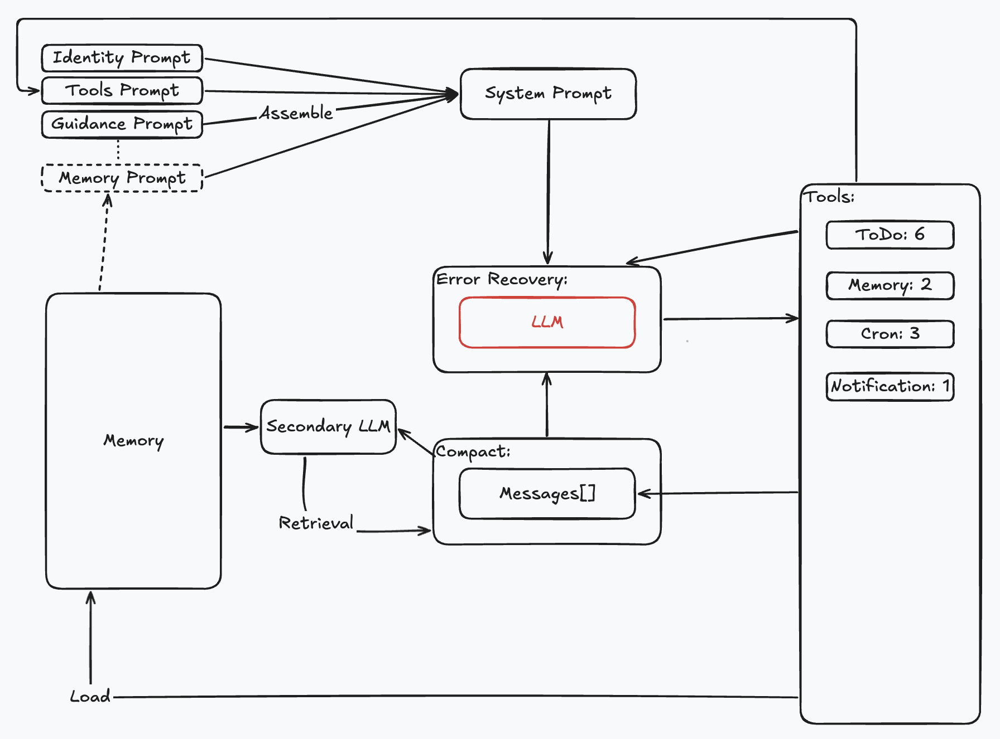
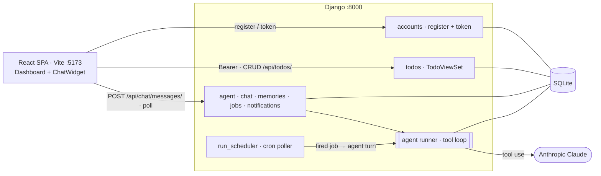

<div align="center">

# 📝 Agentic ToDo

A multi-user TODO app fronted by an **agentic AI assistant**. From one chatbox it does CRUD
on your todos, schedules reminders that later **fire themselves**, and remembers your
preferences — every action reflected live in the dashboard.

[](https://www.python.org/)
[](https://www.djangoproject.com/)
[](https://www.django-rest-framework.org/)
[](https://react.dev/)
[](https://docs.anthropic.com/)
[](#testing)

</div>

---

## 🤖 The agent

<div align="center">
  
</div>

One **tool-calling loop** (`agent/runner.py`) powers both chat turns and fired cron jobs — the
chat endpoint and the `run_scheduler` command share the same tools, prompt assembly, and
recovery. Each turn maps to the diagram above:

- **Dynamic system prompt** — reassembled each turn from live state: identity, the
  auto-generated **tool catalog** (from the schemas, never hand-maintained), current time,
  todo stats, and the user's injected **memory**. → `prompt.py`
- **LLM call with recovery** — 429 backoff w/ jitter, 529 → fallback model, `max_tokens`
  escalation + continuation, one prompt-too-long trim, graceful no-key degradation. → `llm.py`
- **Caller-scoped tools** — a fixed 12-tool catalog; each handler is a **closure over
  `request.user`**, so the model gets no id it can override and any cross-user id resolves to
  a benign "not found". → `tools.py`
- **Secondary-LLM memory retrieval** — once per turn a cheaper Claude model picks the stored
  facts relevant to the message and injects only those; at/below
  `AGENT_MEMORY_RETRIEVAL_THRESHOLD` facts it injects all (no extra call), and any failure
  falls back to all. → `memory.py`
- **Auto-compaction** — before each call, deterministic passes (no summariser LLM)
  shrink the in-flight context: an oversized tool result is truncated, older tool outputs
  collapse to a placeholder, then past a char budget the oldest turns are dropped at a safe
  user-prompt boundary. Only the in-flight context shrinks; the stored transcript stays
  complete. → `compaction.py`
- **Persisted `Messages[]`** — the transcript seeds context across turns; per-user **memory**
  is upserted by key. → `models.py`

| Agentic feature | What it does |
|---|---|
| **Chat → action** | Natural-language CRUD on todos via the tool loop; the chat shows each tool call it made. |
| **Agentic cron** | `schedule_cron` persists a 5-field job; when it fires, a **real agent turn** runs for that user and calls `notify_user`. |
| **Per-user memory** | `remember` / `recall` durable facts, injected into every system prompt (length-capped). |
| **Reactive UI** | Agent changes **flash yellow, then apply:** todos/reminders/memory rows highlight first, then create / update / fade. |
| **Notifications** | Header bell popover + bottom-left toasts, polled every ~10 s. |
| **Hardened** | Bounded tool-loop turns; isolation enforced structurally; the API key is never logged or returned. |

## Base app

A multi-user TODO list where each user manages a private set of items, JWT-protected and
SQLite-backed. The assistant is **optional**: with no `ANTHROPIC_API_KEY` set, chat returns
`503` and the scheduler idles; todos, auth, and the rest of the app keep working.

| | |
|---|---|
| **Backend** | Django + DRF + SimpleJWT |
| **Frontend** | React 18 + Vite (vanilla `fetch`, plain CSS, no new deps) |
| **Database** | SQLite |
| **Auth** | JWT access tokens (30 min), `Authorization: Bearer <token>` |
| **AI** | Anthropic Claude (tool use); model configurable by env |

Core boundaries: registration with salted PBKDF2 passwords; every `/api/` request gated by
a valid JWT (`401` otherwise); CRUD with structured `400` validation; **per-user isolation**
via `get_queryset` (another user's row → `404`, never leaking existence); paginated lists.

## Architecture



The SPA keeps the JWT in `localStorage`; a `401` clears it and returns to login. The same
`request.user` scoping from Core boundaries holds on the server for the agent's tools too, so
ownership is enforced regardless of what the client or the model asks for.

## Quick Start

**Prerequisites:** Python 3.9+, Node 18+.

```bash
# 1. Backend → http://localhost:8000
cd backend
python3 -m venv .venv && .venv/bin/pip install -r requirements.txt
cp .env.example .env          # set SECRET_KEY; add ANTHROPIC_API_KEY to enable the assistant
.venv/bin/python manage.py migrate
.venv/bin/python manage.py runserver

# 2. Scheduler (second terminal): fires agentic cron jobs
.venv/bin/python manage.py run_scheduler

# 3. Frontend → http://localhost:5173 (third terminal)
cd frontend && npm install && npm run dev
```

Register, then click the sparkles button (bottom-right) and try *"add buy milk, then mark
my oldest done"*, *"remind me to stretch every hour"*, or *"remember I prefer short titles"*.
Watch the dashboard update live. Point the UI elsewhere with `VITE_API_BASE` in
`frontend/.env`.

The scheduler polls every `AGENT_SCHEDULER_INTERVAL`s (default 30) and matches cron at minute
granularity; jobs fire only while it runs (no backfill).

#### Agent configuration (`backend/.env`)

| Var | Default | Purpose |
|---|---|---|
| `ANTHROPIC_API_KEY` | _(blank)_ | Enables the assistant. Blank ⇒ chat `503`s, scheduler idles; rest of app works. Never logged or returned. |
| `ANTHROPIC_MODEL` | `claude-opus-4-8` | Model used for tool-use chat. |
| `ANTHROPIC_FALLBACK_MODEL` | `claude-sonnet-4-6` | Switched to after repeated 529/overloaded errors. |
| `ANTHROPIC_SECONDARY_MODEL` | `claude-haiku-4-5` | Cheaper model for the per-turn memory-retrieval pass. |
| `AGENT_MEMORY_RETRIEVAL_THRESHOLD` | `5` | At/below this many facts, inject all and skip the retrieval call. |
| `AGENT_SCHEDULER_INTERVAL` | `30` | Scheduler poll cadence (seconds). |
| `AGENT_MAX_TURNS` | `8` | Tool-loop turn cap per turn (runaway guard). |
| `AGENT_CONTEXT_CHAR_BUDGET` | `60000` | Context size (JSON chars) past which rule-based auto-compaction trims. |

## API Reference

| Method | Endpoint | Description |
|---|---|---|
| `POST` | `/api/auth/register` · `/api/auth/token` | Create a user / obtain a JWT pair (no auth) |
| `GET` `POST` `PATCH` `DELETE` | `/api/todos/` `…/{id}/` | CRUD on the user's todos (paginated) |
| `GET` | `/api/todos/stats/` | `{open, done, total}` for the dashboard |
| `GET` `POST` | `/api/chat/messages/` | Read transcript / send a message → `{messages, actions}` (or `503` w/o a key) |
| `POST` | `/api/chat/messages/reset/` | Clear the conversation |
| `GET` `DELETE` | `/api/memories/` `…/{id}/` | List / forget remembered facts |
| `GET` `DELETE` | `/api/scheduled-jobs/` `…/{id}/` | List / cancel reminders (with human schedule + next-fire labels) |
| `GET` `PATCH` `DELETE` | `/api/notifications/` `…/{id}/` | List / mark read / delete (+ `mark-all-read/`, `clear/`) |

All `/api/` routes except register/token require a bearer token. The agent's **12 tools** run
owner-scoped ORM ops and reuse `TodoSerializer` validation; they live in `agent/tools.py` and
the system-prompt catalog is generated from their schemas.

## Testing

```bash
cd backend && .venv/bin/python manage.py test     # Ran 77 tests: OK
```

A **fake Anthropic client** is injected throughout, so the suite is fully offline and
deterministic — the real API is never called. It covers the base auth/CRUD/validation/
isolation suite plus the agent: cron validate/match (incl. day-of-month-or-day-of-week), a
full chat turn, the no-key `503` path, tool + memory isolation (incl. prompt injection),
scheduler firing (double-fire and one-shot guards), LLM recovery (prompt-too-long trim,
`max_tokens` tool_use), and rule-based auto-compaction (non-mutating, with the stored
transcript preserved).

## Project Structure

```
backend/
├── config/   # settings, urls (DRF + JWT + CORS + agent include)
├── accounts/ # registration + SimpleJWT
├── todos/    # Todo model, serializer, viewset (+ stats), tests
└── agent/    # AI agent app
    ├── models.py     # Conversation, ChatMessage, Memory, ScheduledJob, Notification
    ├── prompt.py     # dynamic system-prompt assembly (catalog from tools.py)
    ├── memory.py     # secondary-LLM memory retrieval (relevance pass + fallback)
    ├── compaction.py # rule-based context compaction (cap / collapse / boundary-safe trim)
    ├── tools.py      # TOOL_SCHEMAS + build_handlers(user) closure (isolation guardrail)
    ├── llm.py        # Anthropic client + RecoveryState + with_retry
    ├── runner.py     # run_agent_turn / run_cron_turn: the shared tool loop
    ├── cron.py       # pure 5-field cron validate / match / humanize
    ├── scheduler.py  # run_due_jobs: minute-granular firing w/ double-fire guard
    ├── views.py · serializers.py · urls.py
    ├── management/commands/run_scheduler.py
    └── tests.py      # offline suite (fake Anthropic client)
frontend/src/  # api.js, App, AuthView, Dashboard, ChatWidget, Header, Stats,
               # TodoList, SidePanels, Toasts, Icon, util, styles.css
ui-design/     # the provided design kit (tokens, mockup, reference JSX)
docs/          # prd/PRD.md · prd/PRD-ai-agent.md
```

## Scope

Built against approved specs: [`PRD.md`](docs/prd/PRD.md) (base) and
[`PRD-ai-agent.md`](docs/prd/PRD-ai-agent.md) (agent).

**Out of scope:** sharing/collaboration, due dates/tags, OAuth/refresh tokens, production
hardening (HTTPS, rate limiting); for the agent: streaming, multi-conversation UI, RAG/vector
memory, summarising-LLM compaction (the deterministic passes above cover it), and broker infra
(Celery/Redis).

**Known limitation:** chat turns are synchronous and the scheduler is a single local poller —
retry sleeps and the LLM call block the request worker thread. Fine for local single-user use;
production would offload turns to a task queue.

## License

MIT
