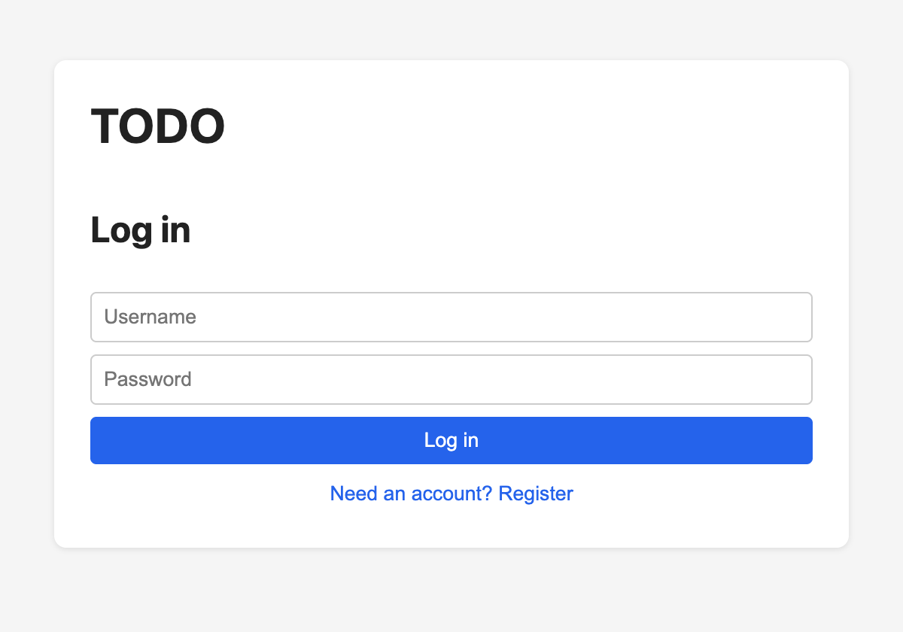
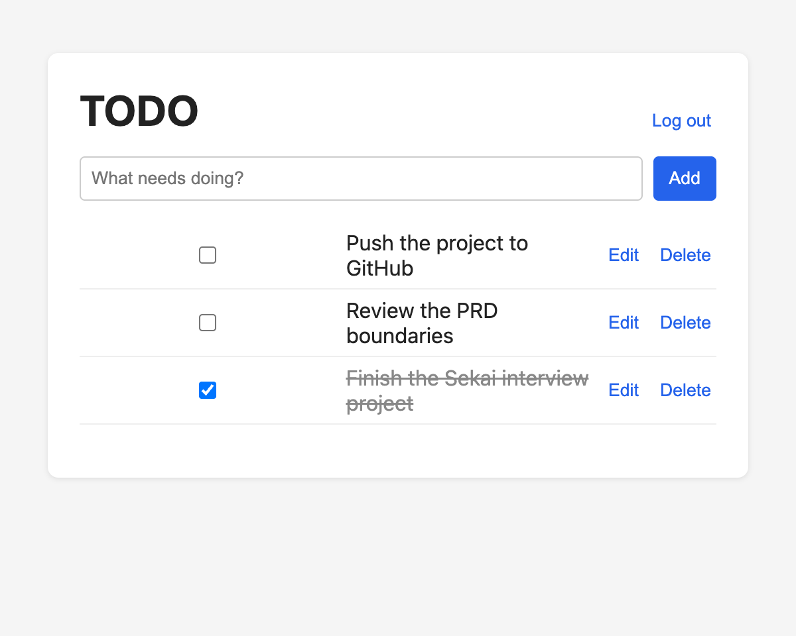
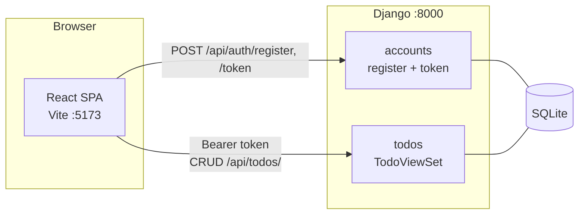

<div align="center">

# 📝 Multi-User TODO

A small, full-stack TODO application built test-first from an approved PRD.
Register, log in, and manage your own todos — backed by JWT auth and a REST API.

[](https://www.python.org/)
[](https://www.djangoproject.com/)
[](https://www.django-rest-framework.org/)
[](https://react.dev/)
[](https://vitejs.dev/)
[](#testing)

</div>

---

## Overview

A multi-user TODO list where each user manages a private set of items. Authentication
is JWT-based, data persists in SQLite, and the UI is a minimal React SPA. Built for
**local development**, with a backend test suite covering the auth flow, CRUD, input
validation, and per-user data isolation.

| | |
|---|---|
| **Backend** | Django + Django REST Framework, SimpleJWT |
| **Frontend** | React 18 + Vite (vanilla `fetch`, minimal CSS) |
| **Database** | SQLite (Django default) |
| **Auth** | JWT access tokens (30 min), `Authorization: Bearer <token>` |

## Screenshots

| Login / Register | Todo list |
|---|---|
|  |  |

## Features

| Feature | Detail |
|---|---|
| **Register & log in** | Username + password; passwords stored as salted PBKDF2 hashes, never returned. |
| **JWT-protected API** | Every `/api/todos/` request requires a valid bearer token; expired/absent tokens get `401`. |
| **CRUD on todos** | Create, list, edit, toggle-complete, and delete — changes persist across reloads. |
| **Per-user isolation** | `get_queryset` filters by owner; another user's item returns `404`, never leaking its existence. |
| **Input validation** | DRF serializers reject empty / missing / over-length titles with structured `400` errors. |
| **Pagination** | List endpoint is paginated (page size 50) to bound payloads. |

## Architecture



The React app stores the JWT in `localStorage` and attaches it as a bearer token on
every API call. A `401` from the API clears the token and returns the user to the login
screen. The `TodoViewSet` scopes all queries to `request.user`, so ownership is enforced
on the server regardless of what the client requests.

## Quick Start

### Prerequisites

- Python **3.9+**
- Node **18+** and npm

### 1. Backend (Django API → http://localhost:8000)

```bash
cd backend
python3 -m venv .venv
.venv/bin/pip install -r requirements.txt
cp .env.example .env                       # then edit SECRET_KEY
.venv/bin/python manage.py migrate
.venv/bin/python manage.py runserver
```

### 2. Frontend (Vite dev server → http://localhost:5173)

```bash
cd frontend
npm install
npm run dev
```

Open http://localhost:5173, register an account, and start adding todos.
To point the UI at a different API URL, set `VITE_API_BASE` in `frontend/.env`
(default `http://localhost:8000/api`).

## API Reference

| Method | Endpoint | Auth | Description |
|---|---|---|---|
| `POST` | `/api/auth/register` | — | Create a user → `201` |
| `POST` | `/api/auth/token` | — | Obtain `{access, refresh}` JWT pair |
| `GET` | `/api/todos/` | ✅ | List the user's todos (paginated) |
| `POST` | `/api/todos/` | ✅ | Create a todo |
| `GET` | `/api/todos/{id}/` | ✅ | Retrieve one todo |
| `PATCH` | `/api/todos/{id}/` | ✅ | Update title / description / completed |
| `DELETE` | `/api/todos/{id}/` | ✅ | Delete a todo |

A `Todo` has: `id`, `title` (required), `description` (optional), `completed`
(default `false`), `created_at`, `updated_at`, and an `owner` foreign key.

## Testing

The backend was written test-first. Run the suite with:

```bash
cd backend && .venv/bin/python manage.py test
```

```
Ran 21 tests in ~3s — OK
```

Coverage spans the auth flow (register, token, bad credentials → `401`), CRUD happy
paths, input validation, and cross-user isolation (User A cannot read or mutate User
B's todos).

## Project Structure

```
.
├── backend/
│   ├── config/          # settings, urls (DRF + JWT + CORS)
│   ├── accounts/        # registration + SimpleJWT token endpoints
│   ├── todos/           # Todo model, serializer, viewset, tests
│   └── requirements.txt
├── frontend/
│   └── src/             # api.js, App, AuthView, TodoList
├── docs/screenshots/
├── PRD.md               # the approved product requirement doc
└── REVIEW.md            # boundary-compliance review of the implementation
```

## Design Notes & Scope

This project was built against an approved spec: see [`PRD.md`](PRD.md) for the full
product requirements and boundaries, and [`REVIEW.md`](REVIEW.md) for a boundary-by-boundary
compliance review of the final implementation (with code evidence and remaining risks).

In line with the PRD, the following are intentionally **out of scope**: sharing/
collaboration, due dates and tags, email verification / password reset / OAuth, and
production hardening (HTTPS, refresh-token rotation, rate limiting). There are no
refresh tokens — users re-login when the 30-minute access token expires.

## License

MIT
